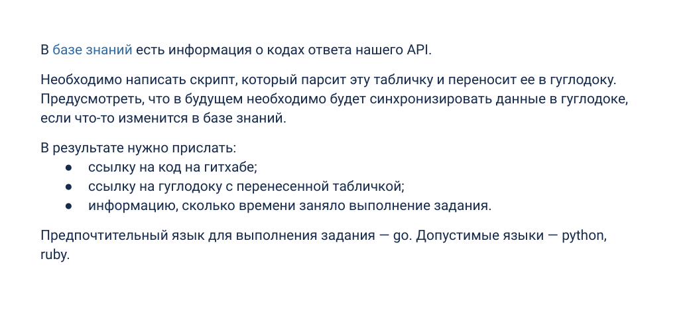

## Тестовое задание для HFLabs
[Cсылка](https://docs.google.com/document/d/1w4wTqvP4coGwCKstok9A1uo40ToYfxJD7aCBXV9RTB8/edit) на тестовое + [ссылка](https://confluence.hflabs.ru/pages/viewpage.action?pageId=1181220999) на базу знаний

Финальная [гугл-таблица](https://docs.google.com/spreadsheets/d/1ycwnwKE9SKdiYTtBhIR2qpUsr1OH0s1279YMvN6-deg/edit?usp=share_link)

## Комментарии
Чтобы запустить программу, используйте мейкфайл в коренвой папке. Если запускаете на линуксе, проверьте команду которая поднимает docker-compose.
Программа работает в докере.

Реализация состоит в парсинге страницы конфлюенса + загрузке таблицы в гугл документ. В программе не использованы базы данных, все хранится в оперативной памяти. Обновление сейчас рассчитано на поллинг([polling](https://en.wikipedia.org/wiki/Polling_(computer_science))) раз в 12 часов, при этом намного эффективнее сделать вебхук, для которого нужны админские права на конфлюенсе.

Также апи гугла позволяет настроить форматирование таблиц + есть возможность переносить таблицу в гугл документ по типу ворда. Функции могут быть добавлены в следующих версиях.
